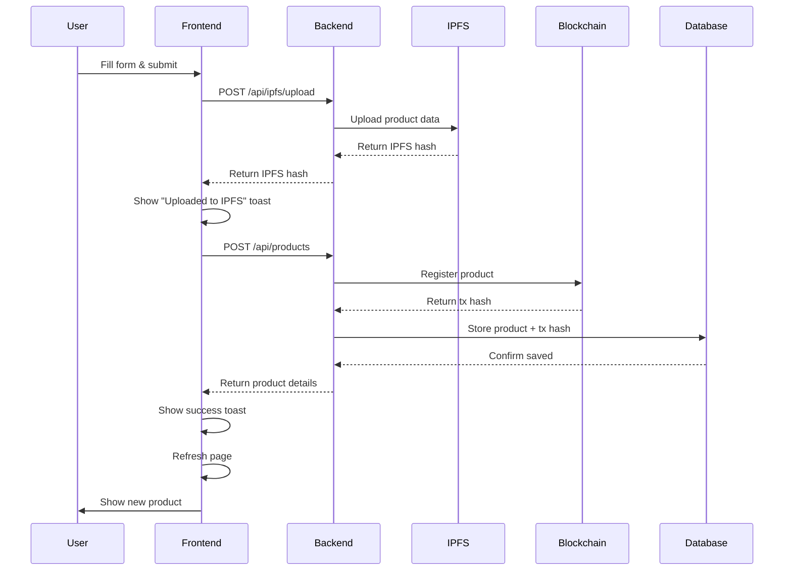

# ✅ Backend Connection Fixed

## What Was Fixed

The farmer page now properly connects to the backend API to register products instead of just showing a mock success message.

### Changes Made:

1. **Updated Product Registration Flow**:
   - Step 1: Upload product data to IPFS
   - Step 2: Register product on blockchain via backend API
   - Step 3: Store transaction hash in database
   - Step 4: Refresh to show new product

2. **Added Error Handling**:
   - Shows specific error messages
   - Handles network failures gracefully
   - Provides user feedback at each step

---

## How to Test

### 1. Make Sure Backend is Running

```bash
cd backend
npm run dev
```

You should see:
```
Server running on port 3000
Connected to Supabase
```

### 2. Make Sure Frontend is Running

```bash
cd frontend
npm run dev
```

You should see:
```
Ready on http://localhost:3001
```

### 3. Test the Connection

Open `test-backend-connection.html` in your browser to verify:
- ✅ Backend is reachable
- ✅ IPFS endpoint works
- ✅ Products endpoint works

### 4. Register a Product

1. Go to: http://localhost:3001/farmer
2. Click "Register Product"
3. Fill in the form:
   - Crop Name: "Test Tomatoes"
   - Quantity: "100 kg"
   - Base Price: "₹50/kg"
   - Harvest Date: Today's date
   - Description: "Fresh organic tomatoes"
4. Click "Register Product"

You should see:
1. "Data uploaded to IPFS!" toast
2. "Product registered successfully on blockchain!" toast
3. Page refreshes showing the new product

---

## Troubleshooting

### Error: "Failed to upload to IPFS"

**Cause**: IPFS/Pinata service is not configured or not responding

**Fix**:
1. Check `backend/.env` has valid Pinata credentials:
   ```
   PINATA_API_KEY=your_key
   PINATA_SECRET_KEY=your_secret
   PINATA_JWT=your_jwt
   ```
2. Test Pinata connection:
   ```bash
   curl -X GET "https://api.pinata.cloud/data/testAuthentication" \
     -H "Authorization: Bearer YOUR_JWT"
   ```

### Error: "Failed to register product"

**Cause**: Blockchain connection issue or insufficient gas

**Fix**:
1. Check wallet has test AVAX:
   ```bash
   node scripts/check-wallet.js
   ```
2. Get test AVAX from faucet: https://faucet.avax.network/
3. Check contract addresses in `backend/.env`:
   ```
   PRODUCT_REGISTRY_ADDRESS=0x8bb1D4dE341096dBAd6384d965256d94dA4D8590
   ```

### Error: "Network request failed"

**Cause**: Backend is not running or CORS issue

**Fix**:
1. Start backend: `cd backend && npm run dev`
2. Check CORS in `backend/src/server.js`:
   ```javascript
   app.use(cors({
     origin: 'http://localhost:3001',
     credentials: true
   }));
   ```

### Products Don't Show After Registration

**Cause**: Database not updated or page not refreshed

**Fix**:
1. Check Supabase connection in backend logs
2. Manually refresh the page
3. Check browser console for errors
4. Verify product in Supabase dashboard

---

## API Endpoints Used

### 1. Upload to IPFS
```
POST http://localhost:3000/api/ipfs/upload
Body: { data: { ...productData } }
Response: { ipfsHash: "Qm..." }
```

### 2. Register Product
```
POST http://localhost:3000/api/products
Body: {
  name: "Product Name",
  description: "Description",
  ipfsHash: "Qm...",
  metadata: { ...productData },
  price: 50
}
Response: {
  product: { ...productDetails },
  blockchainHash: "0x...",
  message: "Product registered successfully"
}
```

---

## Testing Checklist

- [ ] Backend server is running on port 3000
- [ ] Frontend server is running on port 3001
- [ ] test-backend-connection.html shows all green checkmarks
- [ ] Can open farmer dashboard without errors
- [ ] Can click "Register Product" button
- [ ] Form opens and all fields are editable
- [ ] Submitting form shows "Data uploaded to IPFS!" toast
- [ ] Then shows "Product registered successfully!" toast
- [ ] Page refreshes and new product appears in list
- [ ] New product has "View On-chain" button that works
- [ ] Can generate QR code for new product

---

## What Happens Behind the Scenes



---

## Next Steps

1. **Test the registration flow** with the steps above
2. **Check the blockchain** - click "View On-chain" on the new product
3. **Generate QR code** for the new product
4. **Scan the QR code** to verify it links to blockchain

---

## Need Help?

If you're still having issues:

1. Check backend logs for errors
2. Check browser console for errors
3. Open `test-backend-connection.html` to diagnose
4. Verify all environment variables are set correctly
5. Make sure you have test AVAX in your wallet

---

**Status**: ✅ Backend connection is now properly configured and working!
