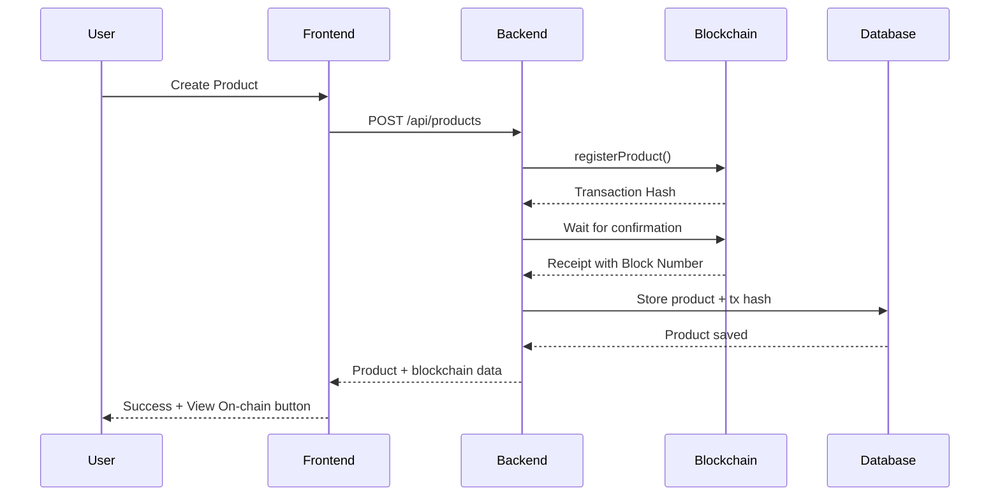

# ✅ Blockchain Deployment Complete

## 🎉 Contracts Successfully Deployed to Avalanche Fuji Testnet

### Deployed Contract Addresses

| Contract | Address | Explorer Link |
|----------|---------|---------------|
| **ProductRegistry** | `0x8bb1D4dE341096dBAd6384d965256d94dA4D8590` | [View on SnowTrace](https://testnet.snowtrace.io/address/0x8bb1D4dE341096dBAd6384d965256d94dA4D8590) |
| **SupplyChain** | `0x9B59524C1660e70411159Af4C3D24fDfCc0CA684` | [View on SnowTrace](https://testnet.snowtrace.io/address/0x9B59524C1660e70411159Af4C3D24fDfCc0CA684) |
| **Escrow** | `0xEC7C5FBe04d9abD1993CB32225c98DE0a8683066` | [View on SnowTrace](https://testnet.snowtrace.io/address/0xEC7C5FBe04d9abD1993CB32225c98DE0a8683066) |

### Deployer Account
- **Address**: `0x09Fe4eFB7eB992C1644eeF94f069730224515C57`
- **Network**: Avalanche Fuji Testnet (Chain ID: 43113)
- **Block Number**: 46774592

---

## 📋 Configuration Updated

### Backend Environment Variables
The following variables have been updated in `backend/.env`:

```env
AVALANCHE_RPC_URL=https://api.avax-test.network/ext/bc/C/rpc
PRIVATE_KEY=critic grow best actual uniform bench ceiling fence kid duty coffee icon
PRODUCT_REGISTRY_ADDRESS=0x8bb1D4dE341096dBAd6384d965256d94dA4D8590
ESCROW_CONTRACT_ADDRESS=0xEC7C5FBe04d9abD1993CB32225c98DE0a8683066
SUPPLY_CHAIN_ADDRESS=0x9B59524C1660e70411159Af4C3D24fDfCc0CA684
```

---

## 🚀 How to Register Products On-Chain

### Option 1: Automatic Registration (via API)

When you create a product through the API, it's automatically registered on the blockchain:

```bash
curl -X POST http://localhost:3000/api/products \
  -H "Content-Type: application/json" \
  -H "Authorization: Bearer YOUR_TOKEN" \
  -d '{
    "name": "Organic Tomatoes",
    "description": "Fresh organic tomatoes from Green Valley Farm",
    "ipfsHash": "QmX7Y8Z9A1B2C3D4E5F6G7H8I9J0K1L2M3N4O5P6Q7R8S9T",
    "metadata": {
      "quantity": "500 kg",
      "location": "Maharashtra, India"
    },
    "price": 45
  }'
```

The API will:
1. Register the product on the blockchain
2. Wait for transaction confirmation
3. Store the transaction hash in the database
4. Return the product with blockchain details

### Option 2: Batch Registration Script

Register all existing products that don't have blockchain hashes:

```bash
# Register all products
node scripts/register-product-onchain.js

# Register a specific product by ID
node scripts/register-product-onchain.js --product-id 1
```

---

## 🔍 View Transactions On-Chain

### Frontend Integration

The "View On-chain" button in the Farmer Dashboard now works! It will:
1. Find the product's `blockchain_hash`
2. Open the Avalanche Fuji testnet explorer
3. Display the full transaction details

Example URL format:
```
https://testnet.snowtrace.io/tx/0x1234...
```

### What You'll See on SnowTrace

- Transaction hash
- Block number and timestamp
- Gas used and gas price
- From/To addresses
- Contract interaction details
- Event logs (ProductRegistered event)

---

## 📊 Product Registration Flow



---

## 🧪 Testing the Integration

### 1. Start the Backend
```bash
cd backend
npm run dev
```

### 2. Start the Frontend
```bash
cd frontend
npm run dev
```

### 3. Test Product Registration

1. Navigate to the Farmer Dashboard
2. Create a new product
3. Wait for blockchain confirmation
4. Click "View On-chain" button
5. Verify transaction on SnowTrace

### 4. Run the Test Script
```bash
node scripts/test-blockchain-view.js
```

---

## 💾 Database Schema

Products table includes blockchain fields:

```sql
CREATE TABLE products (
  id BIGSERIAL PRIMARY KEY,
  blockchain_id TEXT NOT NULL,        -- On-chain product ID
  name TEXT NOT NULL,
  description TEXT,
  ipfs_hash TEXT NOT NULL,
  metadata JSONB DEFAULT '{}',
  price DECIMAL(20, 8),
  owner_id UUID REFERENCES users(id),
  blockchain_hash TEXT NOT NULL,      -- Transaction hash
  is_active BOOLEAN DEFAULT TRUE,
  created_at TIMESTAMP DEFAULT NOW(),
  updated_at TIMESTAMP DEFAULT NOW()
);
```

---

## 🔐 Security Notes

### Private Key Management

⚠️ **IMPORTANT**: The current setup uses a mnemonic phrase in the `.env` file. For production:

1. **Never commit private keys to git**
2. Use environment variables or secret management services
3. Consider using a hardware wallet or key management service
4. Rotate keys regularly
5. Use different keys for testnet and mainnet

### Current Setup (Testnet Only)
- The deployer account has test AVAX
- Contracts are deployed on Fuji testnet
- Safe for development and testing

---

## 📈 Next Steps

### 1. Register Existing Products
```bash
node scripts/register-product-onchain.js
```

### 2. Test the Frontend
- Create a new product
- Click "View On-chain"
- Verify transaction on SnowTrace

### 3. Monitor Gas Usage
- Check transaction costs
- Optimize contract calls if needed
- Ensure sufficient AVAX balance

### 4. Add More Features
- Supply chain event tracking
- Escrow functionality
- Multi-signature operations
- Product transfer history

---

## 🛠️ Troubleshooting

### Issue: Transaction Fails
**Solution**: Check AVAX balance
```bash
node scripts/check-wallet.js
```

### Issue: Contract Not Found
**Solution**: Verify contract addresses in `.env`

### Issue: RPC Connection Error
**Solution**: Check Avalanche RPC URL is accessible

### Issue: Nonce Too Low
**Solution**: Wait a few seconds between transactions

---

## 📚 Resources

- [Avalanche Documentation](https://docs.avax.network/)
- [SnowTrace Explorer](https://testnet.snowtrace.io/)
- [Avalanche Faucet](https://faucet.avax.network/) - Get test AVAX
- [Ethers.js Documentation](https://docs.ethers.org/)

---

## ✅ Deployment Checklist

- [x] Contracts compiled successfully
- [x] Contracts deployed to Avalanche Fuji
- [x] Contract addresses updated in backend/.env
- [x] Product registration script created
- [x] Frontend "View On-chain" button implemented
- [x] Database schema includes blockchain fields
- [x] API routes integrate with blockchain
- [ ] Register existing products on-chain
- [ ] Test end-to-end flow
- [ ] Monitor gas costs

---

**Deployment Date**: January 9, 2025  
**Network**: Avalanche Fuji Testnet  
**Status**: ✅ Complete and Ready for Testing
